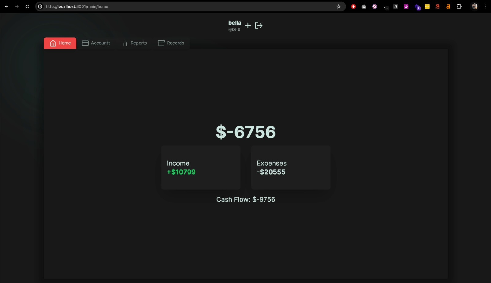
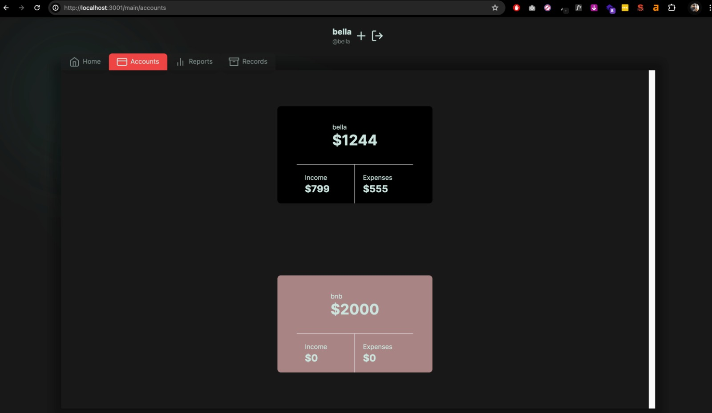
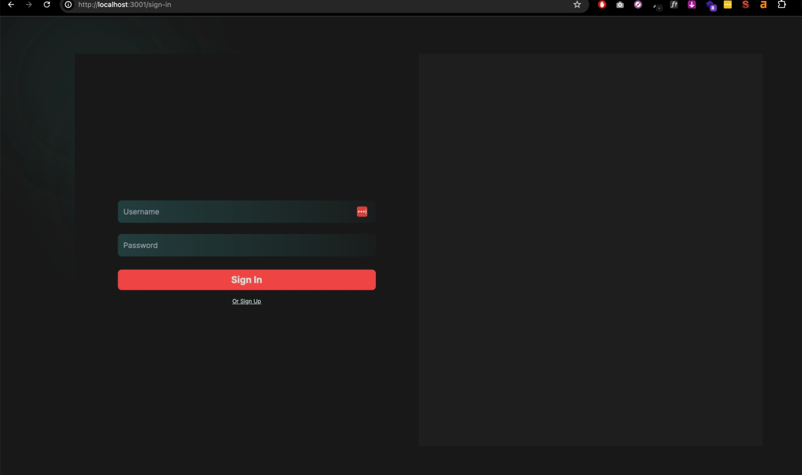
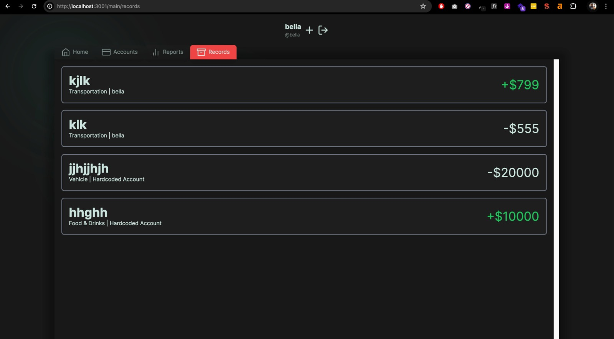
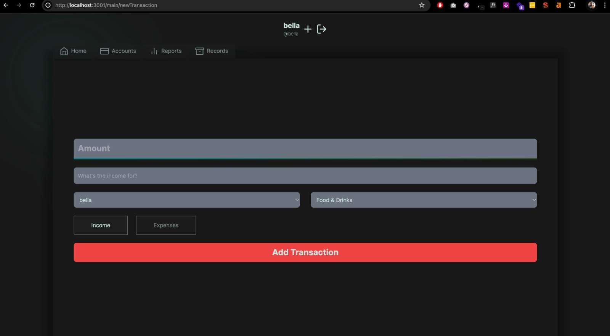

# Wallet Base Expense Tracker (MERN)
```
npm run build
```
change env by adding
```
PORT
MONGODB_URI
JWT_SECRET
```


 
# Run project
```
npm install
npm run dev
```
 
 
# Prod
```
 npm start
```

## Screenshots





